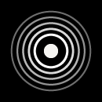

<div align="center">



# Radir-Sky

**Native Tactical Flight Radar & Continuous Desk-Toy Display for Rabbit R1 & Android**

[](LICENSE)
[](https://developer.android.com)
[](https://kotlinlang.org)
[-orange.svg)](https://developer.android.com/about/versions/14)

---

### 🎬 Demo Video


</div>

---

> [!CAUTION]
> **IMPORTANT DISCLAIMER**
> In order to install and run Radir-Sky on a Rabbit R1 device, your device **must be unlocked/rooted** or running custom Android software with ADB enabled.
> 
> The author does **NOT** recommend modifying your Rabbit R1 hardware or software and assumes **NO responsibility or liability** for any broken, bricked, or non-functional devices, data loss, or voided warranties.

---

## 📖 Overview & Core Features

**Radir-Sky** is an open-source native Android tactical flight radar app engineered specifically for compact displays, including the **Rabbit R1 hardware device (480x640 vertical resolution)**. Designed for 24/7 continuous desk-toy usage, it features a dark tactical military HUD interface with high-contrast `#FF5A36` accent range rings and custom `iA Writer Quattro` typography.

Powered primarily by the open-source **ADSB.lol REST API** (with automatic failover to the **OpenSky Network REST API**), Radir-Sky tracks aircraft in real time within a 25 nautical mile (~46km) overhead radius.

### 🌟 Key Highlights

- ✈️ **Live ADS-B Flight Tracking**: Real-time position, altitude, ground speed, callsign, and heading tracking.
- 🎯 **Smooth 60 FPS Dead-Reckoning Engine**: Continuous vector extrapolation and position interpolation for smooth target motion without visual snapping.
- ⚡ **Optimized Performance & Culling**: Automatic proximity sorting (hard-capped to the 25 closest aircraft) combined with Canvas viewport culling to maintain ultra-fast frame rates.
- 🎛️ **Physical Hardware Zoom**: Full hardware volume key integration (**Volume Up**: Zoom in down to 5km; **Volume Down**: Zoom out up to 150km).
- 📍 **100% Open-Source Location Engine**: Built natively with AOSP `android.location.LocationManager` (GPS/Network) and an encrypted HTTPS IP Geolocation fallback (`freeipapi.com`).
- 🌙 **24/7 Desk-Toy Display Mode**: Prevents screen autolock (`FLAG_KEEP_SCREEN_ON`) and runs in immersive full-screen mode with automatic error backoff handling.
- 🔒 **Zero Proprietary SDKs**: 100% open-source stack with zero Google Play Services dependencies and zero telemetry.

---

## 🎮 Hardware Controls & Tactical UI

Designed specifically for single-handed interaction on compact Android devices and the Rabbit R1:

| Control / Input | Context | Action |
| :--- | :--- | :--- |
| **Volume Up** | Tactical Canvas | **Zoom In** radar view (reduces range ring radius down to 5km limit). |
| **Volume Down** | Tactical Canvas | **Zoom Out** radar view (expands range ring radius up to 150km limit). |
| **Drag / Touch Pan** | Tactical Canvas | **Manual Pan** map viewport across latitude/longitude coordinates. |
| **Target Tap** | Aircraft Blip | **Lock Aircraft** and open bottom HUD detail card (Callsign, Altitude, Speed, Heading). |
| **Recenter Icon** | Bottom Right | **Reset Viewport** back to user's live GPS/Location coordinates. |

---

## 🛠️ Tech Stack & Architecture

- **Language**: Kotlin 1.9
- **Build Tool**: Gradle 8.7 (Kotlin DSL)
- **Minimum SDK**: API 26 (Android 8.0)
- **Target SDK**: API 34 (Android 14)
- **UI Framework**: Jetpack Compose & Custom Compose Canvas (`TacticalRadarCanvas`)
- **Networking**: Ktor Client (`cio` / `android` engine) with `kotlinx.serialization`
- **Location Engine**: Native AOSP `LocationManager` + HTTPS IP Geolocation fallback (`freeipapi.com`)
- **Data Providers**: ADSB.lol REST API (Primary) & OpenSky Network API (Fallback)

---

## 📁 Project Structure

```text
radir-sky/
├── radir_demo.mp4                            # Source Demonstration Video
├── radir_demo.gif                            # Inline Streaming Animated Demo
├── app/
│   ├── src/main/
│   │   ├── java/com/radirsky/app/
│   │   │   ├── MainActivity.kt               # Main Activity & Immersive Fullscreen Controller
│   │   │   ├── data/
│   │   │   │   ├── location/
│   │   │   │   │   └── LocationManager.kt    # Native AOSP GPS & HTTPS IP Location Engine
│   │   │   │   ├── model/
│   │   │   │   │   ├── Aircraft.kt           # ADS-B Aircraft Data Model
│   │   │   │   │   └── Lce.kt                # Loading/Content/Error Sealed State Wrapper
│   │   │   │   └── network/
│   │   │   │       ├── AdsbLolRepository.kt  # Primary ADSB.lol REST API Client
│   │   │   │       ├── OpenSkyRepository.kt  # Fallback OpenSky Network REST API Client
│   │   │   │       └── FlightRadarRepository.kt # Composite Resilient Repository
│   │   │   └── ui/
│   │   │       ├── RadarViewModel.kt         # Live Polling & State Management ViewModel
│   │   │       ├── components/
│   │   │       │   ├── AircraftInterpolator.kt # 60 FPS Dead Reckoning Extrapolation Engine
│   │   │       │   └── TacticalRadarCanvas.kt  # Custom Compose Canvas Radar HUD Renderer
│   │   │       └── theme/
│   │   │           ├── Theme.kt              # Dark Tactical Radar Palette (#FF5A36)
│   │   │           └── Type.kt               # iA Writer Quattro Typography Setup
│   │   ├── res/
│   │   │   ├── drawable/radir_icon.png       # Application Launcher Icon
│   │   │   └── font/                         # Embedded iA Writer Quattro TTF Fonts
│   │   └── AndroidManifest.xml
│   └── build.gradle.kts
├── font/
│   └── ia-writer-quattro/                    # iA Writer Quattro Typeface Source & License
├── gradle/wrapper/
│   ├── gradle-wrapper.jar
│   └── gradle-wrapper.properties
├── gradlew                                   # Unix Gradle Wrapper Script
├── gradlew.bat                               # Windows Gradle Wrapper Batch Script
├── build.gradle.kts
├── settings.gradle.kts
├── gradle.properties
├── .gitignore
├── LICENSE                                   # Apache License 2.0
└── README.md                                 # Project Documentation
```

---

## 🚀 Building & Installation

### Prerequisites
- JDK 17 or higher (`JAVA_HOME`).
- Android SDK with API level 34 installed (`ANDROID_HOME`).
- Rabbit R1 or compatible Android device with ADB enabled.

### 1. Clone the Repository
```bash
git clone https://github.com/twentythrill/radir-sky.git
cd radir-sky
```

### 2. Build Debug APK
```bash
./gradlew assembleDebug
```
*The compiled APK will be output to: `app/build/outputs/apk/debug/app-debug.apk`*

### 3. Install on Device via ADB
Connect your Android device or Rabbit R1 via USB with ADB enabled:
```bash
adb install -r app/build/outputs/apk/debug/app-debug.apk
```

---

## 🔒 Security & Privacy Audit

Prior to public release, this repository underwent a comprehensive dependency and security audit:
- ✅ **No Private API Keys or Secrets**: Uses public open data endpoints (ADSB.lol & OpenSky Network).
- ✅ **No Unencrypted Cleartext Traffic**: All network requests use secure HTTPS endpoints (`https://api.adsb.lol`, `https://opensky-network.org`, `https://freeipapi.com`).
- ✅ **Zero Telemetry**: No analytics, tracking, or remote logging SDKs are included.

---

## 📜 License & Attributions

- **Source Code**: Released under the **[Apache License 2.0](LICENSE)**.
- **Typography**: Features the **iA Writer Quattro** font family by Information Architects Inc. (based on IBM Plex Typeface), licensed under the **[SIL Open Font License 1.1](font/ia-writer-quattro/LICENSE)**.
- **Flight Data**: Live flight telemetry provided by the open community projects **[ADSB.lol](https://adsb.lol)** and **[OpenSky Network](https://opensky-network.org)**.

> [!IMPORTANT]
> **Trademark Disclaimer**: *Rabbit R1 and Rabbit are trademarks of Rabbit Inc. Radir-Sky is an independent open-source software project developed by the community and is not affiliated with, endorsed by, or sponsored by Rabbit Inc.*
